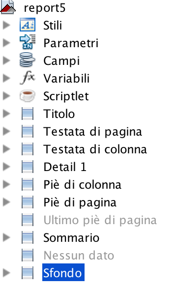
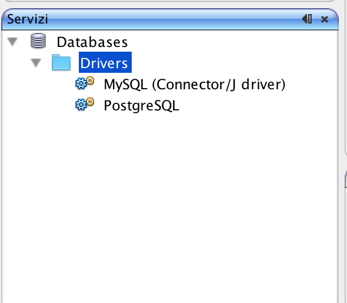

# How to create a report with Jasper Report

## Introduction

Platform supports report generation through Jasper Report, a reporting engine used to generate PDF documents, starting from template files having .jasper format.

A .jasper template can be created through another tool, named iReport, freely downloadable from

[https://sourceforge.net/projects/ireport/files/iReport/iReport-4.5.1/](https://sourceforge.net/projects/ireport/files/iReport/iReport-4.5.1/)

**Important note**: it is strongly recommended to download and install the 4.5.1 version of iReport, since the current Jasper Report engine version embedded in Platform is the 4.5.1

You can download a more recent version but you must be sure to change the compatibility level to 4.5.1 and be sure to use ONLY iReport features supported in 4.5.1 and not the most recent ones.

Once downloaded and installed iReport, you can start creating your own report templates.

iReport allows you to create a template and save the source file in .jrxml format. It also provides a Compile button used to convert \(compile\) the .jrxml to .jasper \(binary\) format, which is the one you have to upload in Platform and run on it.

## Creating a report in iReport

In order to create a report template, open iReport and choose New -&gt; Report

At this point you can select one of the templates available or simply choose Blank A4.

A report is always composed of the following inputs:

* **parameters**, based on data \(string, date, numeric\) passed forward from Platform
* **fields**, dynamic data retrieved internally from the report \(or passed forward to it\)



A report can show:

* not repeated data, like the header of a document
* a list of rows

Optionally, it is also possible to create nested sub-areas, thanks to the **groups**.

A page is also composed of different sections, from top to bottom:

* **title**, not repeated and showed only in the first page
* **page header**, repeated in every page
* **column header**, tipically it contains the labels of column headers
* **detail**, it contains data repeated for each input row
* **column footer**, not always used, tipically it contains additional labels for the columns
* **page footer,** repeated in every page
* **summary**, not repeated and showed only in the first page


It is possible to re-size each of them and hide them if not needed all, by changing their height \(by setting it to 0\). You can do it in two ways: either by using the drag 'n drop of the borders between two areas or by selecting the area on the palette on the left \(**Report inspector**\)  ****and set the corresponding height in the **properties palette** on the right.

In addition, a report can contain also a **background** layer, which is painted below the transparent main layer, reported above \(headers, detail, footers...\)

You can add any number of controls from the Palette on the top-right of the iReport editor and put them into one of the areas. Alternatively, you can simply drag parameters/fields available in the Report inspector and drop them into one of the areas.

The main controls are:

* **static text** - a label whose content doesn't change
* **text field**  - a parameter/variable/field/translation or a concatenation of them and static content

Examples for a text field:

```text
$F{FIRST_NAME}
$F{FIRST_NAME}+" "+$F{SURNAME}
$P{MY_INPUT_PARAMETER}
$R{textToTranslate}
```

For more details about how to create a report template, see [here](https://drive.google.com/open?id=0B9VP-oAXtobiVVEyV29VY0l6ek0).

iReport/Jasper Report supports a variety of different data sources for input **fields**: the most common are SQL based data and JSON based data.

In the following sections the two alternatives are described in detail.

## Filling a report starting from SQL

As described above, a report can show:

* not repeated data, like the header of a document
* a list of rows

The two main areas for the two parts just described are:

* the Title area or the Page header, filled starting from the **main SQL query or parameters**
* the Detail area, filled with a list of rows, coming from the **subreport SQL query**; alternatively, it would be possible to use the main SQL query here too, if it is a JOIN between header data and row data \(header data duplicated for each row...\)

The main SQL query is defined by right clicking on the root node in the Report Inspector and choose Edit Query: here it is possible to define the SQL query to execute. This query is executed in a specific database schema.

Before doing it, a database schema must be defined. Any number of database schemas can be defined using the **Report Datasources** feature, available in the main toolbar on the top of iReport. Once doing it, the right schema must be selected: the current report will be executed on the selected schema.

Before doing it, the right JDBC driver must be installed within iReport. This can be done by choosing the menubar on the top: **Window -&gt; Services**.



A **Services** window should appear: right click on the **Drivers** node to add the JDBC driver \(one of more .jar files\).

Finally, a sub-report can be defined for the detail if needed.

## Filling a report starting from a business component

As described above, a report can show:

* not repeated data, like the header of a document
* a list of rows

The two main areas for the two parts just described are:

* the Title area or the Page header, filled starting from the **main SQL query or parameters of the same business component used for the Detail area**
* the Detail area, filled with a list of rows, coming from the business component.

Using a business component to fill in the detail area can lead to different scenarios:

* still use the **main SQL query** to fill in the Title/Page header area and use the **business component** only for the detail area, when the data retrieval is so complex that a SQL query is simply not the right choice
* use the **business component both** for filling in the Title/Page header area and for the detail area; this comes in handy when the data retrieval is so complex that a SQL query is simply not the right choice or when the report is not generated starting from a relational database, so that SQL cannot be used
* use **input parameters** to fill in the Title/Page header area and use the **business component** only for the detail area, when the data retrieval is so complex that a SQL query is simply not the right choice

The business component to link here MUST be a "Server-side javascript business component for a list" and, consequently, it must provide a JSON string having this format:

```javascript
{
  "valueObjectList": [
  { "name": "...", "surname": "...", ... },
  { "name": "...", "surname": "...", ... },
  ...
  ]
}
```

Additional requirements to meet on the iReport side are:

* * the query to set must remain empty BUT the **query language** MUST be set to **JSON**
  * declared fields must respect the naming of the JSON response, i.e. fields must be attributes \(e.g. name, surname, etc.\); moreover, the “**description**” **property** of each field must be filled too, **with the same attribute name**, otherwise the resulting report will not contain any result \(null values instead of the real values provided by the JSON response\).

## Internationalization

A report can contain translations in terms of:

* text to translate according to the language \(e.g. labels\)
* data coming from a database, formatted according to the language \(e.g. date format, number format...\)

**Date format**

A Date or Date-time input value can be expressed as java.util.Date, java.sql.Date or java.sql.Timestamp or java.lang.String. 

The latter case is when all input data come from a business component which passes forward a JSON string, so dates are converted in text, always expressed as "yyyy-MM-dd HH:mm:ss".

Consequently, according to the type of the input data, an optional conversion from String to Date is needed: in the latter case this conversion is required. In order to do it, select the text field containing the SF{myStringTypeField} and set the following two settings:

* replace the content of **Expression Text Field** property with: 

```javascript
new java.text.SimpleDateFormat("yyyy-MM-dd HH:mm:ss").parse($F{myStringTypeField})
```

* change the **Expression Class** property from "java.lang.String" to "java.sql.Timestamp" \(or "java.sql.Date"\)

At this point the content to show is a Date object.

Finally, set the right format for that field, which can be done in two alternative ways:

* using the **Pattern** property, where a fixed format can be expressed \(e.g. dd/MM/yyyy\); this is probably unlikely to do, since the report would always has the same format, independently on the current language
* using the **Pattern expression** property, which can contain something dynamic, reckoned at run-time, example something like: $R{DateFormat}

In the second scenario, you have to include a DateFormat key in any .properties file, where there can be a value as follows:

```javascript
DateFormat=dd/MM/yyyy
```


**Number format**

A numeric input value should be always expressed as java.math.BigDecimal. 

In case the input data is expressed as a String, you have first top convert it into a java.math.BigDecimal. In order to do it, select the text field containing the SF{myStringTypeField} and set the following two settings:

* replace the content of **Expression Text Field** property with: 

```javascript
new java.math.BigDecimal($F{myStringTypeField})
```

* change the **Expression Class** property from "java.lang.String" to "java.math.BigDecimal"

In order to set the right format, set the right format for that field, which can be done in two alternative ways:

* using the **Pattern** property, where a fixed format can be expressed \(e.g. \#,\#\#0.00\); this is probably unlikely to do, since the report would always has the same format, independently on the current language
* using the **Pattern expression** property, which can contain something dynamic, reckoned at run-time, example something like: $R{NumberFormat}

In the second scenario, you have to include a NumberFormat key in any .properties file, where there can be a value as follow:

```javascript
NumberFormat=#,##0.00
```

\*\*\*\*

**Translation of labels**

With regards to the translation of labels, a series of .properties text files must be created, in the same folder where the .jasper is created, one for each language.

A good practice is to name them as the .jrxml file name. For instance, if the template is **myfile.jrxml,** the corresponding translation files can be: **myfile\_it.properties, myfile\_en.properties**

**Important note:** Pay attention to the language identifiers: they must be expressed in lowercase, otherwise with case-sensitive operating systems like Linux/Unix it would not be recognized.

**Important note:** it is important to set the **Resource bundle** report property with the base name for all .properties file, i.e. **myfile**

Once done, the right translations will be automatically fetched at runtime, when executing the report template, according to the language.

For example the italian resource file myfile\_it.properties can be something like:

```text
Invoice=Fattura
Customer=Cliente
```

**Important note:** you cannot translate Static fields, only Text fields: a Text field can be used to contain something to translate, using the special notation:

```text
$R{textToTranslate}
```

where textToTranslate would be an entry in each .property file, where **it is NOT allowed to include spaces** in it: every key must be a text-without-spaces entry.

In case of accents, these can be expressed using the Unicode escape format:

```text
\uxxxx
```

Look at the following link to figure out the unicode hex values for the most common accents:

[https://unicode.org/charts/PDF/U0080.pdf](https://unicode.org/charts/PDF/U0080.pdf)

## Filling a sub-report starting from the same business component

A server-side javascript business component can not only be used to fill in the main report, but also to populate data for any number of sub-reports.

You can do it but injecting the returning JSON object as many additional attributes as you want, one for each sub-report. It means that each additional attribute should contain a list of objects, as in this example:

```javascript
// main list, used to fill in the main report
var list = [
    {
        invoiceNr: 1,
        invoiceYear: 2020,
        corpName: "Sinesy srl",
        productCode: "A1",
        description: "Articolo Uno",
        qty: 1,
        unitPrice: 15,
        price: 15,
        createDate: "2020-03-23 11:00:00"
    },
        {
        invoiceNr: 1,
        invoiceYear: 2020,
        corpName: "Sinesy srl",
        productCode: "A2",
        description: "Articolo 2",
        qty: 3,
        unitPrice: 12,
        price: 36,
        createDate: "2020-03-23 11:00:00"
    }
];

// list used to populate a sub-report
var vats = [ 
    {
        vatCode: '19',
        vatDescription: 'IVA 19%'
    }
    ,
        {
    
        vatCode: '22',
        vatDescription: 'IVA 22%'
    }
];

var response = {
    valueObjectList: list, // main list, used to fill in the main report
    vats: vats // additional attribute, containing a list of object used to populate a sub-report
};
utils.setReturnValue(JSON.stringify(response));
```

It is not required to declare the attributes referred by additional lists \(sub-reports\) when defining the object linked to the business component: object's fields are only related to the fields used by the main report.

The next step is on the iReport side, where a sub-report must be created, starting from the main report template:

* click on the SubReport widget in the palette to create a sub-report
* select "Create new report" and press Next
* select "Blank A4" and press Next
* select Empty data source and press Next
* leave Fields list empty and press Next
* leave Groups empty and press Next
* leave the proposed name and position and select the "Save the field same in a parameter" option and press Next
* select the "Use the same connection" and press Finish

At this point the sub-report has been created: position it in the right place and select it, in order to access its property inspector, where a few settings must be changed:

* change the "Sub-report expression" and remove the proposed path, so that the path+file would be something like: ""./report1\_subreport1.jasper""
* set the "Connection type" to "Use a Datasource expression"
* fill in the "Data source expression" with something like $P{REPORT\_DATA\_SOURCE}.subDataSource\("xxxx"\)

where xxx represents the attribute name filled by the business component with a list of objects, used to populate the sub-report. For the example above, xxx would be "vats".

On the sub-report side, set the JSON as the datasource type and define manually thew fields with the same name/description as the attribute names defined by the business component.

That's all!

## Deploying report artifacts into Platform

A report is composed of at least one file: the .jasper file

Anyway, there can be many other files:

* a .jasper file for each sub-report
* icons/images referred inside the report \(or sub-report\) with relative path
* .properties files, one for each supported language

The easiest way to publish all report artifacts into Platform is by creating a .zip file \(without a base folder included in the zip file\).

Once created the .zip file, use **File Manager** to upload it: use the .zip input field, select the local .zip file and upload it, preferably into a "reports" subfolder, within the application sub-context.

Platform will automatically decompress the .zip file and save its content into the "reports" subfolder.

The only exception to this approach is when the Platform application has been defined to work with multiple company ids \(multi-tenancy application\). In such a scenario, the "reports" subfolder does NOT contain the report's artifacts, rather than a subfolder for each company id: each one containing report's artifacts for a specific company id:

* reports
  * 00000
    * myfile.jasper
    * myfile\_subreport1.jasper
    * company\_00000\_logo.jpg
    * myfile\_IT.properties
    * myfile\_EN.properties
  * 00001
    * ...
  * 00002
    * ...

## Executing a report within Platform

The simplest way to execute a report template and generate a PDF file is by using the utils.saveDocument function, available in a server-side javascript action.

Example:

```javascript
var sourceDirId = ...; 
utils.saveDocument(
    "myfile.jasper", // template location + name
    sourceDirId, // directory id where all .jasper templated are saved (e.g. /opt/tomcat/webapps/platform/appwebcontent/reports)
    null, //  datastoreId, 
    329, // compId
    "PDF", // reportFormat
    {
        InvoiceNr: 1,
        InvoiceYear: 2020,
        Customer: "Pinco Pallo"
    }, // reportParams,
    "/Users/carniel/Downloads/temp/a.pdf" // savePath
);
```

Meaning of the arguments:

**Template relative path + file name**

In the example above, the .jasper file is located in a base dir defined through the directory id, which typically is within a "reports" folder located in the application sub-context.

In case of a multi-company application, an additional subfolder is needed, to have different artifacts for different companies, so that the first argument can become:

```javascript
userInfo.companyId+"/myfile.jasper"
```

In such a case, the .properties files or any other artifact \(like company logo, etc.\) must be put in the same \(company\) subfolder.

**Template absolute path**

The second argument can be set to null, unless all reports have been stored in a different path from the app web-context: in such a scenario, this would be the absolute path where all .jasper files \(and artifacts\) are located. For example the dir id can be defined as:

```javascript
/opt/tomcat/webapps/platform/appwebcontent/reports
```

**Additional datasource**

The additional datasource to use when executing the main SQL query \(and any other sub-report queries\). Set it to null if no SQL query is executed.

**Business component**

This argument is optional: if specified, the corresponding "server-side javascript business component for a list" is executed and the result \(a JSON string\) is passed forward to the report, to fill in the list of rows or any other area.

**Report format**

Supported formats are: PDF or XLS. Pay attention to the XLS format: it should be used carefully, since a report is not optimized for a unlimited width, as for a spreadsheet.

**Report parameters**

Input parameters to pass forward to the report and used by it as $P{myparameters}

**Server absolute path**

The absolute path + file name where saving the resulting PDF document.

