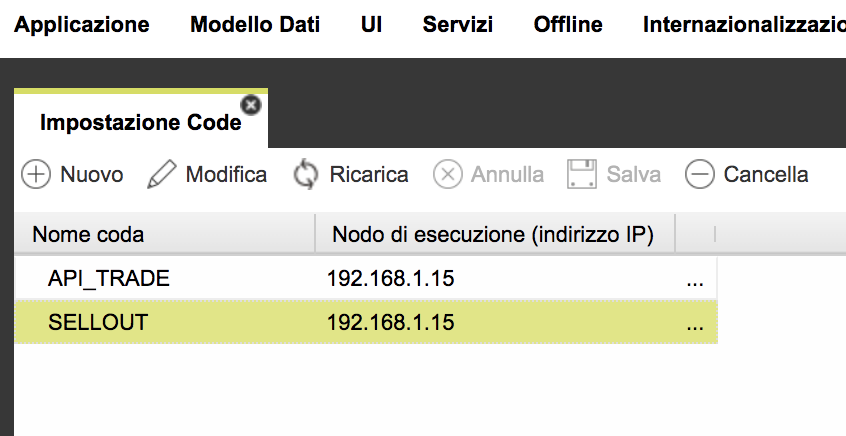
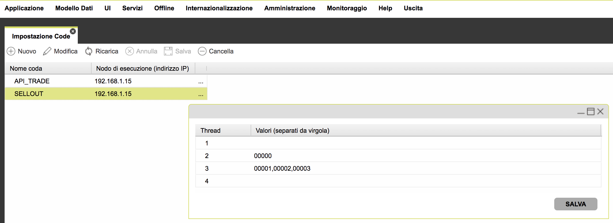

# Setting up a cluster

An application can be considered heavy from the point of view the resources consumption when there is a high consumption of:

* **CPU** - when there are many concurrent user connections or when there are many batches to execute at the same time or batches particularly complex and heavy
* **memory** - when there are SQL queries which fetch a lot of data, maintained in memory or when there are many concurrent user connections and consequently, a lot of memory consumed by user sessions
* **bandwidth** - when there are many concurrent user connections

The first step in order to optimize the resource consumption is to analyze what has been developed:

* are there SQL queries which read more than a hundred records? a paginated reading should be always preferred or a reading using a cursor returning one record a time
* are there many batches in execution? a queue based management should be always preferred in order to execute batches and the number of queues must be limited and predictable \(not depending on data on the database or on data inputs\) and never greater than a few dozens
* are there an unlimited number of API invocations from external systems? this should be always avoided, by setting each web service with an upper limit on the number of invocations per second

Once you have carefully tuned your application with regards to what reported above, the only dimensions still out of control should be the number of end users using your system.

Starting from this perspective, a cluster can be introduced, in order to manage peaks on the use of your application.

Application functionalities can be divided into two categories:

1. online functionalities, i.e. the ones used by end users, through a UI
2. batch functionalities, not directly managed by end users, rather than by scheduled processed and/or batches managed by queues

Google Cloud Platform can help managing a cluster, composed of a set of VMs \(i.e. GCE instances\), each belonging to a specific instance group.

The Google Load balancer can then distribute incoming HTTP\(s\) requests to specific VMs, in order to manage online functionalities.

In the next sections alternative solutions are reported, according to the complexity of the application and resource consumption.

### 

### A cluster composed of exactly two nodes: online and batch

The cheapest solution is:

* Load balancer
  * VM1 - manages online functionalities; **this VM has a fixed IP**
  * VM2 - manages batch functionalities \(scheduled processed and queues\); **this VM has a fixed IP**

This represents the cheapest solution; anyway, it contains two bottlenecks: the VMs are fixed; if they collapse for some reason, the corresponding functionalities are not available any more. 

Consequently, **this solution is good for non multi-tenancy environments** \(e.g. one customer ad hoc installation\), where the resource consumption is predictable and reasonably under control.

In order to set the configurations reported above, you have to configure Platform through the AppDesigner; in the global properties, set the following properties:

* SCHEDULER - Fix the main node used by scheduled processes
* QUEUES - Fix the main node used by process queues

Do **not** activate the "Cluster" check-box in the Platform installation; that is to say, the WEB-INF/web.xml file should have the tag cluster set to false:

```text
                <init-param>
                        <param-name>cluster</param-name>
                        <param-value>false</param-value>
                </init-param>
```

### 

### A cluster composed of a fixed batch node and at least one node for the online

A better solution is the one where there is an instance group of the online nodes, whereas the batch node is out of this instance group, i.e. it is managed entirely by a fixed node.

In such a scenario, you can have this architecture:

* Load balancer
  * online instance group
    * VM1...VMn - manage online functionalities; these can be created on demand, by the Load balancer, according to the resource consumption
  * VMx - manages batch functionalities \(scheduled processed and queues\); **this VM has a fixed IP**

This solution has one only bottleneck: the VM for the batch environment is fixed: if it collapses for some reason, the batch functionalities are not available any more. Anyway, this is rarely a blocking problem and there is all the time to re-start the VM manually. Administrators can be notified by this event through Stackdriver monitoring system.

Consequently, this solution can be considered acceptable \(even though not the best\)  **for multi-tenancy environments**.

In order to set the configurations reported above, you have to configure Platform through the AppDesigner; in the global properties, set the following properties:

* SCHEDULER - Fix the main node used by scheduled processes
* QUEUES - Fix the main node used by process queues

Do **not** activate the "Cluster" check-box in the Platform installation; that is to say, the WEB-INF/web.xml file should have the tag cluster set to false:

```text
                <init-param>
                        <param-name>cluster</param-name>
                        <param-value>false</param-value>
 
```

### 

### A cluster composed of 1 instance group for online and batch

A nearly optimized solution is the one where there is an instance group containing online and batch nodes, that is to say, there is not a clear distinction between batch and online. 

In such a scenario, you can have this architecture:

* Load balancer
  * instance group
    * VM1...VMn - manage online functionalities; these can be created on demand, by the Load balancer, according to the resource consumption; only one of them will become the main node, i.e. the node dedicated to batch functionalities only.

In order to configure the environment as reported above, you have to activate the "Cluster" check-box in the Platform installation; that is to say, the WEB-INF/web.xml file should have the tag cluster set to true:

```text
                <init-param>
                        <param-name>cluster</param-name>
                        <param-value>true</param-value>
                </init-param>
```

In any case, you do **not have** to set the SCHEDULER and QUEUES settings \(main node\) as described in the previous sections. 

In this way, when starting the Platform web applications , each Platform web app will compete to become the main node; moreover, periodically each of these node will check out for the main node availability and can replace it with itself, in case it does not respond any more.


### A cluster composed of 2 instance groups for online and batch

An optimized solution is the one where there is an instance group of the online nodes, whereas the batch node is out of this instance group, i.e. within another instance group.

In such a scenario, you can have this architecture:

* Load balancer
  * online instance group
    * VMo1...VMon - manage online functionalities; these can be created on demand, by the Load balancer, according to the resource consumption
  * batch instance group
    * VMb1..VMbn - manages batch functionalities \(scheduled processed and queues\); these can be created on demand, by the Load balancer, according to the resource consumption

In order to configure the environment as reported above, you have to distinguish between online and batch instance groups, each having its own template VM:

* the online template VM should have the cluster flag set to false
* the batch template VM should have the cluster flag set to true

In any case, you do **not have** to set the SCHEDULER and QUEUES settings \(main node\) as described in the previous sections. 

In this way, when starting the Platform web applications for  the batch instance group, each Platform web app will compete to become the main node; moreover, periodically each of these node will check out for the main node availability and can replace it with itself, in case it does not respond any more.

### Notification messages

Another feature strictly connected with a cluster is the notification message used to prompt the user on the UI about events fired by the server layer, through utils.sendAlertxxx methods.

If you have activated a cluster with the tag &lt;cluster&gt;true&lt;/true&gt; there is nothing more to do.

In case of a cluster having a main node \(for scheduled processed/queues\), that is to say, with the tag &lt;cluster&gt;false&lt;/true&gt;, you have also to set 2 additional global properties, in order to make notifications work correctly:

* **MESSAGES\_URL\_SERVER** - this property must contain an URL, related to the fixed node always available and should be set with something like: **https://fixedIP/plktform**
* **MESSAGES\_IP** this property must contain the IP, related to the fixed node always available and should be set with something like: **fixedIP**

You have always to set both, otherwise you could have loops with the fixed node calling itself.

### Important notes when updating an application

Independently of the cluster setting you have, when publishing an application \(metadata\) it is important to be sure all nodes in cluster have an updated state. Consequently, it is essential to follow these simple steps:

* stop all Platform services on all nodes but one
* update metadata on such node 
* reset the digest, in case you have set an high speed cached environment in production
* start again all other nodes

If you do not follow these steps, you could have an inconsistent state in any of these nodes.

**It is also recommended to add the following setting to the java process defined within the Tomcat service file**, in order to disable the automatic database upgrade each time the Tomcat service is started:

```text
-Dupgradedb="false"
```


### Automatic main node setting in Google Cloud Platform

In case of a cluster of nodes in Google Cloud Platform, you can define a set of instance groups, one for each application domain: online, API, batch.

The batch layer should have its dedicated instance group, composed of ONE ONLY node, named "main node". Since the main node can be re-created over time by the load balancer managing the batch instance group, the node IP can also change over time. It is important to update CON44\__COMMON\__PARAMS records related to the main node, i.e. the ones related to the queue manager, the scheduler and the messaging system.

You can let Platform  update automatically these settings, if you add the following setting to java process defined with the Tomcat service file:

```text
-Dupdateparams=true
```

In this way, each time a node is created and the Tomcat service started, Platform would enquiry GCP web service layer in order to get up to 3 "custom parameters" defined at instance group level:

* **env** - \(optional\) this is the name of the running environment; if found, Platform will override the default value set in the web.xml file and use it internally. You can use the server-side javascript function **utils.getEnvironment\(\)** to get this value
* **batch** - \(optional\) this parameter can be filled with Y or N; if set to Y, Platform will recognize the current VM as the main node and update CON44\__COMMON\_PARAMS records related to the parameters:_ 
  * _QUEUE\__IP - set with the VM local IP
  * QUEUE\__IP\__LOCKED - set to Y
  * _SCHEDULER\__IP - set with the VM local IP
  * SCHEDULER\__IP\__LOCKED - set to Y
  * MESSAGES\_IP - set to Y
  * MESSAGES\_URL\_SERVER - set either to http://&lt;localIP&gt;/platform or http://&lt;localIP&gt;:8080/platform \(the latter in case the record already exists and it has such a port\)
* **queueNames** - \(optional\) it contains a list of couples appId + queueName, each couple separated by a comma, related to queue names which must be executed on the current node; this parameter should be set ONLY IF the batch layer is composed of multiple instance groups, where one is related to the main node and the others to additional batch nodes \(NOT main nodes\), used to run only a sub-set of queues, the ones mentioned in this parameter. That means that "queueNames" should be set ONLY for a node which IS NOT the main node. 

**Example**

```text
queueName = KEEPIT|SELLING,KEEPIT|API_TRADE
```

For the application KEEPIT, two queues will be managed by the current node: SELLING and API\_TRADE.

Consequently Platform would:

* delete all already existing records in CON104\_QUEUE\_NODES table \(additional nodes for queues\) having the EXECUTING\_NODE field set to the current node local IP
* for each queue defined within the "queueNames" parameter, insert/update records in CON104\_QUEUE\_NODES, filling 
  * EXECUTING\_NODE with the current node local IP
  * QUEUE\_NAME with the specified queue name
  * APPLICATION\_ID with the specified app id

Finally, the current Platform node will manage only these two queues.

### Distributing the queue content to multiple threads

A queue is used to limit the server resource consumption, in terms of CPU and memory, so it is always a good practice to enqueue the elaboration to a queue, so that there is always a controlled amount of resources consumed at any time.

However, there can be scenarios where a large amonunt of elements has been enqueued and more performance is required.

There are several approaches to the performance problem:

* the worst solution is the one where multiple queues are used instead of one: in this way, elements can be processed in parallel and performance is increased but it has also been violated the reason why queues should be used: to limit the resource consumption; a wild use of this approach can lead to an unlimited number of queues created or to a too high number of queues used to concurrently execute elements
* the best solution is the one where the bottlenecks are recognized in the business logic and the application is optimized: performance is reached without increasing the server resources or by consuming more of them but conversely, a lower amount of resources is required

In the middle between the two approaches, there is the possibility to execute a upper bound limited amount fo thread per queue. The max number of threads per queue is not unlimited and not directly connected to application dimensions which could increase overtime \(e.g. company ids\).

Platform allows define up to 4 threads per queue, with a default behavior of 1 thread per queue \(a real queue\).

**Do not abuse this feature, do not activate this feature for all queues, do not define hundreds of threads in total,** otherwise the server resources will not be enough to manage such a scenario and the service would collapse.

In order to activate this feature, you have first to define a main node \(through the global parameters, section QUEUE\). Next, you have to define which queues are managed by the main node and optionally by other additional batch nodes. It is not essential to define additional nodes: but you have always to define queue names in the **Service -&gt; Queue Settings** functionality of the AppDesigner:



Once done that click on the "..." button on the right of each row, in order to open the additional settings for a specific queue.

This window contains always 4 rows, one for each thread, where the first one is the "default thread", i.e. the one where all elements in the selected queue will be processed. You cannot change in any way the first row.

Optionally, you can fill in the thread number 2, 3 or 4, by settings a list of "payloads": a specific element will be processed in the thread x only if the element payoad is contained in that list.

Let's suppose that we define the thread payloads as a list of company ids, where there is a company id which generates a very large amount of elements in queue: it is a good idea to dedicate a thread only for it \(company id 00000\).



There can be other 3 company ids \(00001,0002,0003\) which require a faster response in the elaboration, so a third thread is dedicated to them. 

All other elements, having a payload not matching these 4 company ids will be managed by the default thread \(first thread\).

In order to make these settings working, it is also needed to pass forward to the element such a payload:  when enqueuing an element in the queue, use the **utils.enqueueActionWithNote\(\)** function and use the last argument \(note\) to pass forward the payload. The queue system will match this payload value for the element with the ones specified in the Queue Settings functionality and decide for each element in which thread it will processed.


