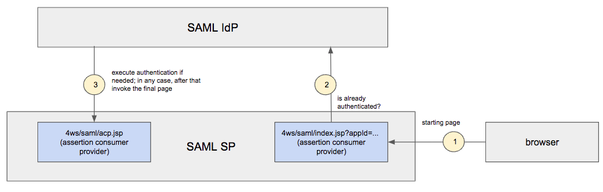

# Theme customization

## Customizing a Filter Panel

### Adding an icon to the left of a folder title

In order to set an icon to the left of a folder title, in case the folder contains a filter panel:

* add to xtheme.css file something like

```text
.x-tab-strip .x-tab-with-icon span.x-tab-strip-text.myclassename {
	background-image: url(../images/menu/myiconname.png) !important;
}
```

where "myclassname" represents the name of a CSS class referring the icon to show for this specific panel

* set to the "Additional Settings" available in the Filter Panel definition pane something like

```text
iconCls: "myclassname"
```

### 

### Adding additional graphical settings to a filter panel

You can include more settings for a filter panel using the "Additional Settings" available in the Filter Panel definition pane something like.

See [https://docs.sencha.com/extjs/3.4.0/\#!/api/Ext.form.FormPanel](https://docs.sencha.com/extjs/3.4.0/#!/api/Ext.form.FormPanel) to get a whole description of available settings.


### Adding a placeholder inside an input control

It is possible to set an initial tooltip text within the control, which disappears automatically when typing a text in it. In order to do it add to Additional Settings property for a control named **emptyText.**

Example:

```text
emptyText: "abc"
```


## Customizing a Grid Panel

### A grid having rows with different heights

It is not needed to set any additional setting to have rows with different heights: you have simply to set a cell content having multiple lines. Lines can be expressed in HTML format and a new line is represented by the &lt;br&gt; tag.

A good approach can be to bind a server-side javascript business component and use it to fill in the cell content: through javascript you can easily create complex HTML  content, using for example the tags &lt;table&gt; &lt;tr&gt; &lt;td&gt;.

An alternative approach is to do it on the web layer, through the renderer property of a column, where you can define HTML content, for example using the tags &lt;table&gt; &lt;tr&gt; &lt;td&gt;:

```text
value = 
'<table height=200 width=200>'+
'<tr><td>ID  :</td><td>'+record.data.id+'</td></tr>'+
'<tr><td>PIN :</td><td>'+record.data.pin+'</td></tr>'+
'<tr><td>Address :</td><td>'+record.data.address+'</td></tr>'+
'</table>';
```

In this example, the record passed to the row must contains attributes named id, pin and address.


### Adding additional graphical settings to a grid panel

You can include more settings for a filter panel using the "Additional Settings" available in the Grid Panel definition pane something like.

See [https://docs.sencha.com/extjs/3.4.0/\#!/api/Ext.grid.GridPanel](https://docs.sencha.com/extjs/3.4.0/#!/api/Ext.grid.GridPanel) to get a whole description of available settings.


### Customizing column headers

The column header area can contain:

* the column header text
* optionally the ascending/descending icon to show a data ordering \(the column header is a three-state clickable button: no sort, ascending sort, descending sort\)
* optionally the filter icon, used to emphasize the application of a filter condition on such a column; default behavior: visible on the left-top side, beside the text
* optionally the "no filter applied" icon, used to emphasize the application of a filter condition on such a column; default behavior: NOT visible; if set to visible, it would be on the left-top side, beside the text and as an alternative to the filter icon

It is possible to customize the column header content through a series of CSS classes:

**Column header height**

class name: **x-grid3-hd-inner**

Example: how to increase header height

```text
.x-grid3-hd-inner {
    height: 30;
}
```

**Filter condition applied icon**

class name: **filter\_on**

Example: position the filter icon on the bottom-left position

```text
.filter_on {
    position: absolute;
    bottom: 10;
}
```

Example: redefining the filter icon

```text
.filter_on{
	width: 12;
	height: 12;
	background: url(../images/filter_on.gif) no-repeat;
}
```

**NO filter condition applied icon**

class name: **filter\_off**

Example: position the NO filter icon on the bottom-left position

```text
.filter_off {
    position: absolute;
    bottom: 10;
}
```

Example: redefining the NO filter icon

```text
.filter_off{
	display: initial;
	width: 12;
	height: 12;
	background: url(../../extjsutils/images/filter_off.gif) no-repeat;
}
```

\*\*\*\*

\*\*\*\*


## Customizing a Form Panel

### Adding additional graphical settings to a form panel

You can include more settings for a filter panel using the "Additional Settings" available in the Grid Panel definition pane something like.

[/docs.sencha.com/extjs/3.4.0/\#!/api/Ext.form.FormPanel](https://docs.sencha.com/extjs/3.4.0/#!/api/Ext.grid.GridPanel) to get a whole description of available settings.

## Customizing controls of form and filter panel

You can add, for each control contained in a form and filter panel, one or more css cls.   
Access the controls and activate the advanced mode, then click on the style column.

For button control you can set also the icon.



You can set the properties also on panels


